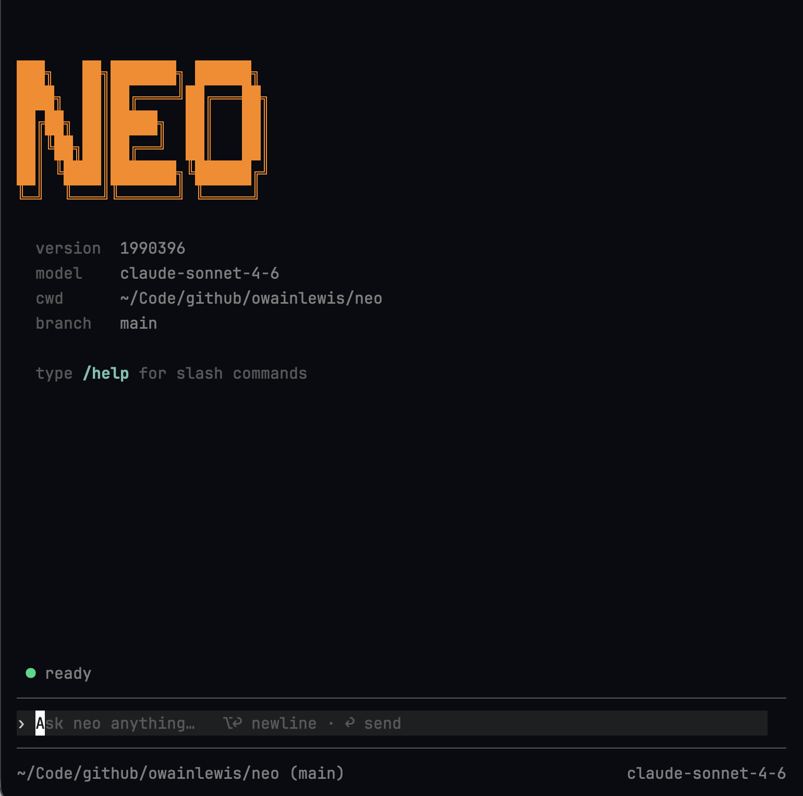

<div align="center">

**Fast · Workflow-first · Open source**

# Neo

### Built for real engineering.

Neo turns complex repository work into a visible workflow. Keep the plan,
tools, tests, reviews, and delivery moving in one terminal.

[](https://go.dev/) [](https://github.com/owainlewis/neo/releases/latest) [](LICENSE)

[Quick start](#quick-start) · [Documentation](website/src/content/docs/docs/quick-start.md) · [Releases](https://github.com/owainlewis/neo/releases)

</div>

<a href="#quick-start">
  
</a>

## The whole workflow, not just the edit

Neo works where engineering happens: in your repository, with your project
instructions, tools, and git history. Give it a real task and follow the work
from first inspection to tested change.

- **Visible by default.** See the plan, active work, tool activity, tests, and
  delegated tasks without reading a wall of chat.
- **One coordinator, focused workers.** Delegate bounded work to subagents and
  bring their evidence back into one coherent workflow.
- **Your model, your choice.** Use Anthropic, OpenAI, Google Gemini, or
  OpenRouter, then switch provider and model without leaving the terminal.
- **Control that fits the task.** Choose trusted, approval-based, or read-only
  permissions. Steer active work or queue the next instruction at any time.
- **A small, dependable foundation.** One native Go binary, built-in tools,
  local sessions, no runtime or plugin stack, and no product telemetry.

## Quick start

### 1. Install Neo

```bash
curl -fsSL https://raw.githubusercontent.com/owainlewis/neo/main/install.sh | bash
```

Homebrew and `go install` are also supported. See every option in the
[installation guide](website/src/content/docs/docs/install.md).

### 2. Connect a model

Neo uses Anthropic by default:

```bash
export ANTHROPIC_API_KEY="sk-ant-..."
```

Prefer OpenAI, Gemini, or OpenRouter? The
[provider guide](website/src/content/docs/docs/quick-start.md) covers API keys,
ChatGPT/Codex subscription login, and the small `neo.yaml` config.

### 3. Start in a repository

```bash
cd your-project
neo
```

Then give Neo the outcome and the process you expect:

```text
Find the cause of the failing test, plan the fix, implement it, run the
relevant checks, and review the final diff.
```

## Make the workflow yours

Neo follows repository instructions from `AGENTS.md` and reusable skills from
`.neo/skills/`. Define how your team plans, tests, reviews, and ships once, then
let every task follow the same process.

Continue with the [user guide](website/src/content/docs/docs/quick-start.md),
or explore the [technical reference](docs/developer/index.md) for configuration,
permissions, sessions, tools, skills, and the CLI.

## Contributing

```bash
git clone https://github.com/owainlewis/neo.git
cd neo
go test ./...
go run ./cmd/neo
```

Start with the [developer documentation](docs/developer/index.md) before
changing the agent loop, providers, tools, or TUI.

## License

[MIT](LICENSE) © Neo Contributors
