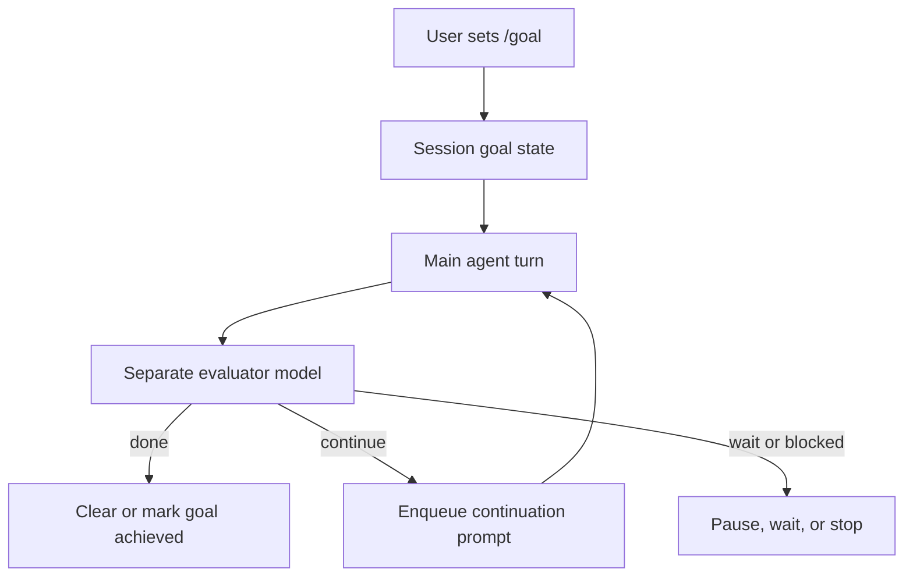
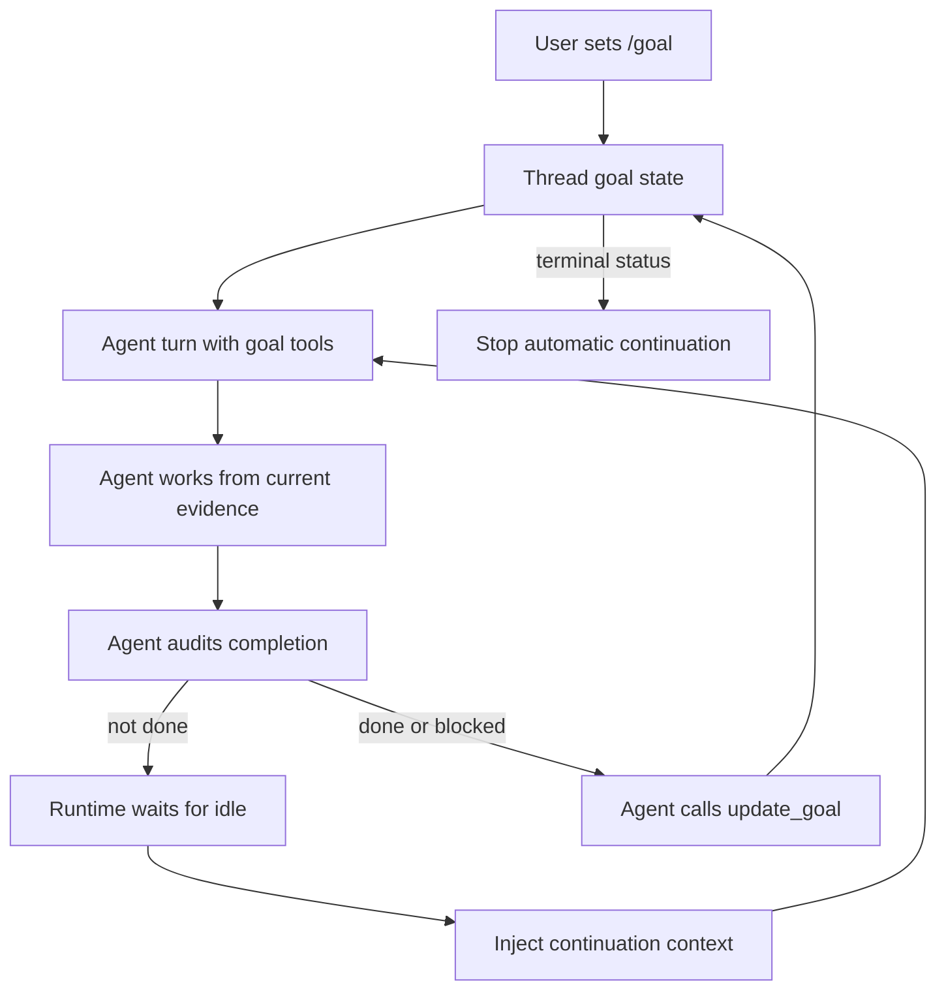
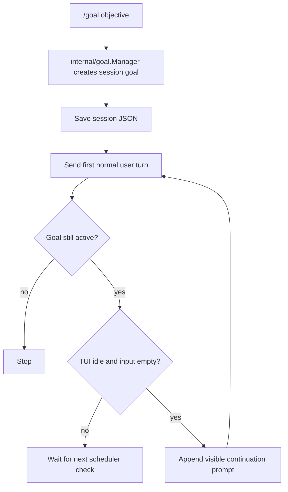

# Neo Goal Runner - Design Spec

Status: Draft.

This spec describes how Neo should implement `/goal`.

`/goal` gives Neo a standing objective that survives across turns in the current session.

Neo starts with the goal as the first normal user turn.

After each turn, Neo checks whether the goal is still active.

If it is active and Neo is idle, Neo adds a continuation prompt and keeps working.

The run stops when the goal is complete, blocked, paused, cleared, or the attempt budget is reached.

Use `/goal` when the agent would otherwise need multiple "keep going" prompts.

Scheduled automation is a separate feature and should be designed separately.

## 1. Source Review

This design is based on the current implementations and docs in Hermes, Claude Code, and Codex.

Sources reviewed:

- Hermes `/goal` implementation: https://github.com/nousresearch/hermes-agent/blob/9259d1e5dacbaae8f6692d9e910c190e64f234a9/hermes_cli/goals.py
- Hermes CLI continuation hook: https://github.com/nousresearch/hermes-agent/blob/9259d1e5dacbaae8f6692d9e910c190e64f234a9/cli.py
- Hermes user docs: https://hermes-agent.nousresearch.com/docs/user-guide/features/goals
- Hermes cron docs: https://hermes-agent.nousresearch.com/docs/user-guide/features/cron
- Claude Code `/goal` docs: https://code.claude.com/docs/en/goal
- Claude Code scheduled tasks docs: https://code.claude.com/docs/en/scheduled-tasks
- Codex goal extension: https://github.com/openai/codex/tree/390b73133b0707ce877ec924b0011c06b776b9e8/codex-rs/ext/goal
- Codex goal runtime: https://github.com/openai/codex/blob/390b73133b0707ce877ec924b0011c06b776b9e8/codex-rs/ext/goal/src/runtime.rs
- Codex goal tools: https://github.com/openai/codex/blob/390b73133b0707ce877ec924b0011c06b776b9e8/codex-rs/ext/goal/src/tool.rs
- Codex goal tool specs: https://github.com/openai/codex/blob/390b73133b0707ce877ec924b0011c06b776b9e8/codex-rs/ext/goal/src/spec.rs
- Codex goal steering prompt: https://github.com/openai/codex/blob/390b73133b0707ce877ec924b0011c06b776b9e8/codex-rs/ext/goal/templates/goals/continuation.md
- Codex user docs: https://developers.openai.com/cookbook/examples/codex/using_goals_in_codex

Hermes implements goals as a session-scoped `GoalManager`.

It stores goal state in session metadata, runs a separate judge model after each completed turn, and enqueues a normal continuation prompt when the judge says to continue.

The useful Hermes lessons are:

- Goal state belongs to the session, so resume restores the goal.
- The continuation is a normal turn, not a system prompt mutation.
- User input preempts automatic continuation.
- Ctrl-C pauses the goal instead of immediately re-queueing work.
- Judge failures fail open, with budget as the backstop.
- Weak judge models need a parse-failure backstop.
- Wait barriers matter for long-running processes.

Claude Code implements `/goal` as a session-scoped prompt-based Stop hook.

After each turn, a small fast model evaluates the condition against the conversation.

The evaluator does not run tools or inspect files independently.

It can only judge what the main agent has surfaced in the transcript.

Claude allows one active goal per session, restores active goals on resume, and clears the active goal when `/clear` starts a new conversation.

The useful Claude lessons are:

- One goal per session is an understandable product rule.
- The goal text can be both the first prompt and the completion condition.
- A separate evaluator can catch some premature "done" claims.
- The evaluator model is only as good as the evidence in the conversation.
- `/goal` and scheduled work are separate products.
- `/clear` should clear the active goal so the session does not keep working from missing context.

Codex implements goals as a first-class thread extension.

It persists thread goal state, exposes goal tools to the model, injects goal steering when the thread is idle, tracks token and wall-clock budget, emits goal update events, and lets the model mark the goal complete or blocked through `update_goal`.

The useful Codex lessons are:

- Goal state should be explicit product state, not inferred from chat text.
- Completion and blocked status should be explicit state transitions.
- Only the user or system should control pause, resume, budget-limited, usage-limited, and clear.
- Continuation should only start when the thread is idle.
- Budget accounting and goal status changes need serialization so external mutations cannot race idle continuation.
- The continuation prompt must tell the agent not to shrink the objective.
- Goal objective text is user-provided data, not higher-priority instruction.

### Three approaches

Hermes and Claude use an evaluator-driven loop.

The main agent works.

A separate evaluator decides whether the goal is done.

If the evaluator says no, the product starts another turn.



Codex uses a state-and-tool-driven loop.

The main agent works and is given goal tools.

The product owns the state machine.

The model may only make narrow lifecycle claims through tools.

If the goal is still active and the thread is idle, the runtime injects continuation context.



Neo Phase 1 should copy the Codex control-plane idea, but not all of Codex's machinery.

Neo should store explicit goal state, expose a narrow goal tool, and continue only from a simple idle scheduler.

Neo should skip token accounting, hidden internal context, dynamic tool visibility, and a separate evaluator model in Phase 1.



### Why Codex is the better base for Neo

Codex is not better because it has more features.

It is better for Neo because its core abstraction is product state, not a hidden evaluator decision.

That matters for a local TUI because state transitions need to survive resume, interrupts, `/clear`, budget limits, and user commands.

With an evaluator-driven design, "done" lives in a second model call.

The product then needs a judge provider path, JSON parsing rules, failure handling, a prompt contract, and rules for what happens when the judge cannot see enough evidence.

With a Codex-style design, "done" is a typed transition.

The product can say:

- The current session has one goal.
- The goal has one status.
- The user and system own pause, resume, clear, and budgets.
- The model can only request `complete` or `blocked`.
- Completion and blocked claims are visible in the transcript and persisted state.
- The scheduler only continues when the TUI is idle.

That is easier to explain and easier to test.

The tradeoff is that the model is partly grading its own work.

Neo should offset that with a strong continuation prompt, concrete evidence requirements, a blocked threshold, and normal user review.

It should not add a second evaluator until there is evidence that self-reported completion is too weak.

### Comparison table

| System | Who decides done? | How does the next turn start? | Where is state stored? | Main strength | Main risk |
|--------|-------------------|-------------------------------|------------------------|---------------|-----------|
| Hermes | Separate judge model after each turn. | Normal continuation prompt is queued. | Session metadata keyed by session ID. | Easy to graft onto an existing chat loop. | Judge parse failures and weak transcript evidence become product behavior. |
| Claude Code | Small fast evaluator model through a session-scoped Stop hook. | Stop hook starts another turn when the evaluator says not done. | Current session. | Very simple user model and independent evaluation. | Requires hook/evaluator machinery and only judges surfaced evidence. |
| Codex | Agent calls goal tools to mark complete or blocked. | Runtime injects goal context when the thread is idle. | Thread goal state. | Explicit inspectable state and serialized product transitions. | The working model can mark its own goal complete. |
| Neo Phase 1 | Agent calls one narrow goal tool, with manager-enforced transitions. | TUI appends a visible continuation prompt only when idle and input is empty. | Optional `goal` field in session JSON. | Simple, reliable, easy to explain, close to current Neo architecture. | Completion quality depends on prompt discipline and evidence checks. |

## 2. Decision

Build `/goal` first.

Do not build `/loop` in this feature.

Do not build reusable goal files in this feature.

Do not build a chat message queue in this feature.

Do not expose YAML, TOML, or another goal definition format.

Use plain English as the user surface and typed Go state as the internal representation.

Phase 1 should use a Codex-style goal tool for explicit completion and blocked transitions.

Phase 1 should use a Hermes-style TUI scheduler to enqueue continuation turns when idle.

Favor simple, visible, reliable behavior over a more autonomous system that is harder to reason about.

Do not add a separate judge model in Phase 1.

The judge model is attractive, but it adds a second provider path, latency, parse failures, and a second place for "looks done" mistakes.

Neo can add an optional judge or audit pass later if self-reported completion is too weak.

## 3. Product Definitions

| Term | Meaning | Neo feature |
|------|---------|-------------|
| Goal | Keep working until a condition is met or the run must stop. | `/goal` |
| Workflow | A visible series of steps for how to do current work. | `workflow` tool, often skill-assisted |
| Skill | A reusable instruction package or procedure. | `$skill` expansion |
| Loop | Run on a schedule or interval. | Future automation feature |
| Agent loop | The internal provider and tool-use cycle for one user turn. | Already exists in `internal/agent` |

A workflow is how the agent plans and communicates the work.

A goal is the durable control-plane state that decides whether Neo should continue.

A skill may create or recommend a workflow, but a skill is not a goal.

## 4. User Surface

The first useful version is:

```text
/goal <objective>
/goal status
/goal pause
/goal resume
/goal clear
```

`/goal <objective>` sets or replaces the current session's single goal and starts the first turn immediately.

`/goal status` shows the active goal, state, attempts used, budget, and last reason.

`/goal pause` stops automatic continuation but keeps the goal.

`/goal resume` resumes automatic continuation with a fresh attempt budget.

`/goal clear` removes the goal.

Optional later commands:

```text
/goal draft <objective>
/subgoal <criterion>
/subgoal list
/subgoal remove <n>
/goal wait <pid> [reason]
/goal unwait
```

Do not add `/loop` as an alias for this.

When Neo eventually adds scheduled work, design it separately as automation.

## 5. Internal State

Add an `internal/goal` package.

The user writes plain English.

Neo stores a typed goal object.

Phase 1 has a simple invariant: one session can have at most one goal.

The goal belongs to the session, not to the whole Neo app.

Starting a new session starts with no goal.

Resuming a session restores its goal if it has one.

Switching sessions switches the goal context because the goal is part of that session's saved state.

`internal/goal.Manager` owns the current state.

The TUI, goal tool, scheduler, and session layer should ask the manager to make transitions instead of mutating state directly.

The manager is deliberately boring:

- It serializes state changes with a mutex.
- It enforces valid status transitions.
- It counts attempts.
- It enforces the blocked threshold.
- It rejects stale tool updates for an old goal ID.
- It returns snapshots for rendering, persistence, and tool output.

The minimum shape is:

```go
type State struct {
    ID          string
    Objective   string
    Contract    Contract
    Status      Status
    Attempts    Attempts
    Blocked     BlockedAudit
    LastReason  string
    CreatedAt   time.Time
    UpdatedAt   time.Time
}

type Contract struct {
    Outcome      string
    Verification string
    Constraints  []string
    Boundaries   []string
    StopWhen     []string
}

type Attempts struct {
    Used int
    Max  int
}

type BlockedAudit struct {
    Signature string
    Count     int
    LastReason string
}

type Status string

const (
    Active        Status = "active"
    Paused        Status = "paused"
    Complete      Status = "complete"
    Blocked       Status = "blocked"
    BudgetLimited Status = "budget_limited"
    UsageLimited  Status = "usage_limited"
    Cleared       Status = "cleared"
)
```

Persist the state inside the session JSON as an optional top-level `goal` field.

The shape should be:

```go
type Session struct {
    Metadata Metadata      `json:"metadata"`
    Messages []llm.Message `json:"messages"`
    Goal     *goal.State   `json:"goal,omitempty"`
}
```

Save the session immediately after creating a goal, before sending the first turn.

Then save again after each turn and after each user-visible goal transition.

Do not put the full goal in the session index unless the UI later needs it for listing.

Backward compatibility should be simple: old sessions have no `goal` field.

## 6. Goal Tool

Register one model-visible `goal` tool in Phase 1.

Do not mutate the tool registry when goals start or stop.

If no goal is active, the tool should return a clear "no active goal" result.

This is simpler than adding dynamic tool visibility to the current registry.

Use one tool with an `action` field:

```json
{ "action": "get" }
{ "action": "complete", "goal_id": "goal_123", "reason": "go test ./... passed" }
{ "action": "blocked", "goal_id": "goal_123", "reason": "needs API credentials" }
```

`get` returns the current goal ID, objective, status, attempt budget, and stopping rules.

`complete` and `blocked` must include the goal ID returned by `get`.

The manager rejects stale goal IDs.

The model may only mark a goal `complete` or `blocked`.

The user and system own `active`, `paused`, `budget_limited`, `usage_limited`, and `cleared`.

That split is important.

It avoids letting the model silently resume itself, erase the goal, or bypass budget.

`complete` requires a reason with concrete evidence.

`blocked` should require the same blocker to recur for multiple goal turns before the tool accepts it.

Codex uses a strict blocked audit in its continuation prompt.

Neo should enforce the threshold in code, not only in prose.

## 7. Continuation Algorithm

The goal runner sits above the existing agent loop.

It should not make `internal/agent` understand goals.

Control flow:

```text
/goal objective
create session goal with status active
save session immediately
send objective as the first normal user turn
after send completes, save session again
if goal status is complete, blocked, paused, cleared, budget-limited, or usage-limited: stop
if attempts are exhausted: mark budget_limited and stop
if TUI is idle and the input buffer is empty: enqueue a continuation turn
otherwise do nothing until the next scheduler check
repeat
```

Phase 1 should not implement a real chat message queue.

User input wins by preventing automatic continuation, not by being queued behind a running turn.

Continuation turns are normal user-role messages in Phase 1.

They should be visibly marked as goal continuations so transcripts are understandable.

Later, Neo can add an internal-context message type if we want Codex-style hidden steering.

The continuation prompt must preserve the full objective.

It must tell the agent to verify before calling `goal complete`.

It must tell the agent not to redefine success around a smaller task.

It must tell the agent to call `goal blocked` only after the blocked threshold is satisfied.

## 8. Budget

Phase 1 should use attempts, not token budget.

Attempts are easier to reason about in Neo today because `internal/agent` already reports turn completion but does not yet have Codex-style extension token accounting.

Add config:

```yaml
goals:
  max_attempts: 20
```

An attempt is one automatic continuation turn.

The initial `/goal <objective>` turn does not count as an automatic continuation attempt.

When attempts are exhausted, mark the goal `budget_limited` and show a handoff:

```text
Goal budget reached: 20/20 attempts used.
Last reason: tests still fail in internal/session.
Use /goal resume to continue or /goal clear to stop.
```

Later, add token and wall-clock accounting.

Codex shows that token accounting is valuable, but it is too much for Phase 1.

## 9. User Input And Interrupts

User input always wins.

In Phase 1, that means automatic continuation only starts when Neo is idle and the user is not actively interacting with the input.

Neo may enqueue a continuation only if:

- the goal is still active
- no agent turn is running
- the input buffer is empty
- no picker or modal is active
- no pause, clear, interrupt, or cancellation is pending
- the attempt budget has not been exhausted

If the user starts typing before the continuation begins, Neo should not enqueue the continuation.

After the user's next turn finishes, the goal scheduler checks again.

Slash commands that inspect or mutate goal control state should be allowed while a turn is active if they are safe.

Slash commands that start new work should require idle.

Esc or Ctrl-C during an active turn should pause the goal after cancellation.

It should not immediately enqueue another continuation.

The existing `/clear` command should also clear the active goal and cancel any pending continuation.

If the user wants to preserve the goal without continuing, they should use `/goal pause`.

## 10. Workflow Relationship

Do not merge goals and workflows.

The `workflow` tool is for step visibility.

The `goal` tool is for lifecycle control.

A good goal turn may use the workflow tool to show its current plan.

A workflow item completing does not complete the goal.

Only `goal complete` or a user command should complete the goal.

This keeps "how I am doing it" separate from "whether the durable objective is done."

## 11. Safety

Goals do not grant new permissions.

Goals do not widen write access.

Goals do not bypass approval policy.

Goals do not edit generated files by hand.

The active goal objective is user-provided data.

Continuation prompts must wrap it as task context, not higher-priority instruction.

Path boundaries can be advisory in Phase 1.

Enforced path boundaries can come later through the permission layer.

## 12. Implementation Boundaries

Keep the core agent loop policy-free.

Likely package boundaries:

| Area | Responsibility |
|------|----------------|
| `internal/goal` | Goal manager, state snapshots, status transitions, blocked threshold, continuation prompt, tool implementation. |
| `internal/session` | Persist and restore optional goal state. |
| `internal/tui` | Slash commands, status rendering, idle continuation scheduling, interrupt handling. |
| `internal/config` | `goals.max_attempts`. |
| `cmd/neo-docs` | Generated docs for config and commands. |

Do not implement this by teaching `internal/agent` about `/goal`.

Do not implement this by making a workflow checklist durable.

Do not implement this by adding YAML files.

Do not implement this by adding a general-purpose chat queue.

## 13. Alternatives Considered

Hermes-style external judge:

- Upside: independent evaluator can catch some premature self-completion.
- Upside: no model-visible goal tool required.
- Downside: another provider call after every turn.
- Downside: parse failures become product behavior.
- Downside: judge model selection becomes a new config problem.
- Downside: a second model can still be wrong, especially with weak transcript evidence.

Codex-style goal tool and steering:

- Upside: goal state transitions are explicit and inspectable.
- Upside: no hidden judge call or second model config.
- Upside: completion happens in the same transcript as the evidence.
- Upside: continuation prompt can strongly audit completion and blocked claims.
- Downside: the model is grading its own work.
- Downside: prompt quality and tool constraints matter a lot.

Reusable goal files:

- Upside: goals can become shared project assets.
- Downside: introduces trust, path scope, executable verifier, and file format decisions.
- Downside: confuses goals with scheduled loops and workflows.

Real chat queue:

- Upside: the user could submit normal messages while a goal turn is running.
- Downside: it creates ordering, cancellation, editing, transcript, and slash-command priority questions.
- Downside: Neo already has a simpler model where normal chat waits until the current turn finishes.
- Downside: goals only need to avoid interrupting the user, not build a second input system.

The Phase 1 recommendation is Codex-style goal tool plus Hermes-style TUI scheduling.

## 14. Build Order

1. Add `internal/goal` state, manager transitions, blocked audit, and tests.
2. Add optional goal state to `session.Session` and session save/load tests.
3. Save new goal state before the first send and after each transition.
4. Add the always-registered `goal` tool with `get`, `complete`, and `blocked` actions.
5. Add `/goal`, `/goal status`, `/goal pause`, `/goal resume`, and `/goal clear`.
6. Make existing `/clear` clear the active goal and cancel pending continuation.
7. Add continuation prompt generation and TUI idle scheduling.
8. Add the simple scheduler rule: continue only when idle, input is empty, and no modal is active.
9. Add attempt budget handling and `budget_limited`.
10. Add interrupt behavior so cancellation pauses the goal.
11. Add config docs through `go run ./cmd/neo-docs`.
12. Add optional `/goal draft` contract generation later.
13. Add optional wait barriers later.

Stop before scheduled loops.

Stop before reusable goal files.

Stop before YAML.

Those are separate product decisions.
